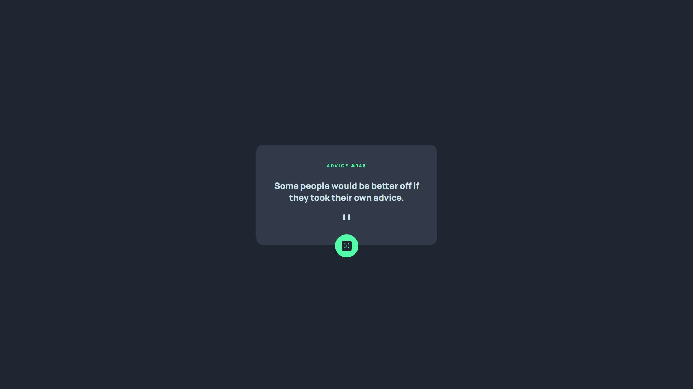

# Frontend Mentor - Advice generator app solution

Essa é minha solução para o desafio [Advice generator app challenge on Frontend Mentor](https://www.frontendmentor.io/challenges/advice-generator-app-QdUG-13db).

## Geral

### O Desafio

Os usuários devem coseguir:

- Ver um layout responsivo dependendo do tamanho do dispositivo deles
- Ver os "hover states" para todos os elementos interativos na página
- Gerar um novo conselho clickando no icone do dado.

### Screenshot



### Links

- Solution URL: [Frontend Mentor](https://www.frontendmentor.io/solutions/advice-generator-app-mTP2jkWDOZ)
- Live Site URL: [GitHub Pages](https://guisegatto.github.io/advice-generator-app/)

## O que aprendi?

Aprendi com mais clareza como funciona o "position: absolute"

```css
.randomize-wrapper {
  display: flex;
  justify-content: center;

  position: relative;

  width: 100%;
}

.randomize-button {
  background-color: hsl(150, 100%, 66%);

  border: hsl(150, 100%, 66%) 18px solid;
  border-radius: 50px;

  cursor: pointer;

  display: inline-block;
  position: absolute;
  top: -10px;
}
```

Aprendi um pouco de como funciona o fetchAPI, e como acessar os dados de uma API.

```js
function getAdvice() {
  fetch(apiUrl)
    .then((response) => response.json())
    .then((data) => {
      quote.textContent = data.slip.advice;
      quoteId.textContent = data.slip.id;
    })
    .catch((error) => console.error(error));
}
```
